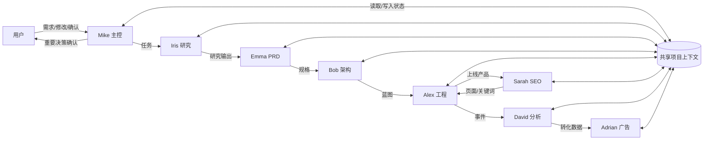
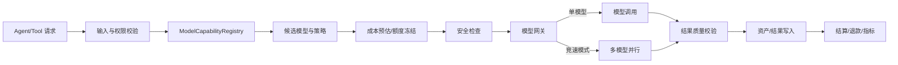
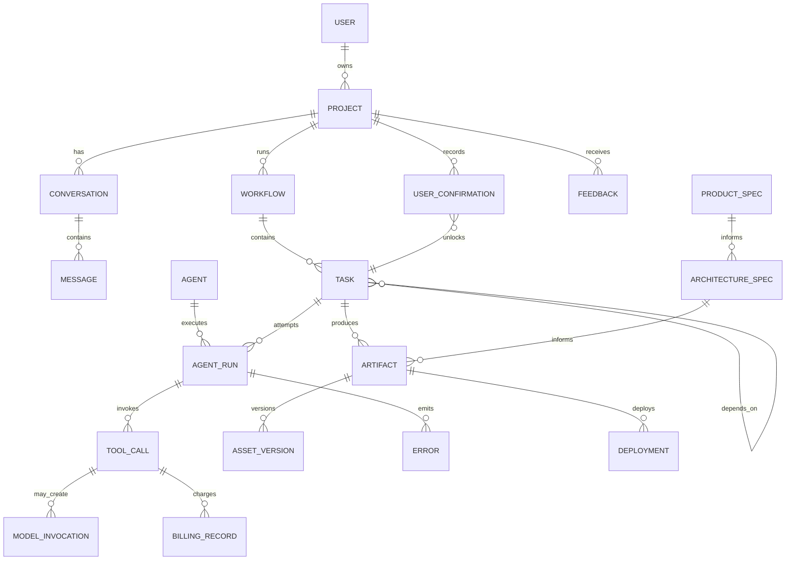
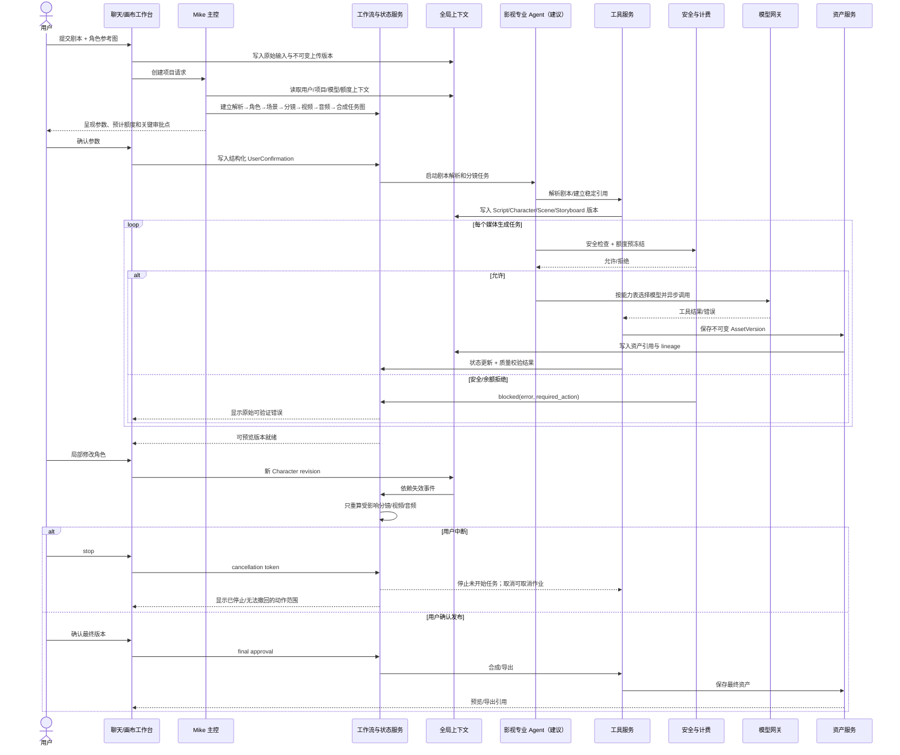

# MetaGPT / MGX / Atoms 产品架构逆向分析

> 版本与命名边界：截至 2026-08-18，浏览器只读访问 `https://mgx.dev/` 后跳转至 `https://atoms.dev/zh`。因此，本报告把当前公开产品称为 **Atoms（原 MGX）**，把 `FoundationAgents/MetaGPT` 称为 **开源框架/实现参考**。本轮没有获得名为 OiiOii 的页面、聊天、画布或资产证据，不能把影视创作模板字段写成 Atoms 当前事实。
>
> 证据标记：**【已确认】** 页面、官方资料或固定提交源码直接支持；**【合理推断】** 根据行为和公开契约推导；**【建议设计】** 为稳定产品所建议；**【未知】** 当前证据不足。

## 1. 执行摘要

**Atoms 的核心架构是一套“共享项目状态 + 固定专家 Agent 团队 + Mike 主控编排 + 人工审批关卡 + 编辑/构建/部署工具”的软件产品交付系统；开源 MetaGPT 提供了消息、计划、角色和工具执行的参考实现，但不能直接证明 Atoms 当前后端实现。**

影视剧本、角色、Face ID、场景、道具、分镜、视频、音频和剪辑并未在已取得的 Atoms 页面或固定提交默认软件公司流程中形成可复核契约。它们只能作为待验证的 OiiOii 领域或建议扩展，不能混入当前 As-Is。

## 2. 证据来源与证据缺口

### 2.1 事实来源清单

| 来源类型 | 已取得证据 | 可确认内容 | 不能确认内容 | 等级 |
|---|---|---|---|---|
| 用户操作 | 本轮只读打开 `mgx.dev`，被重定向到 `atoms.dev/zh` | 当前公开产品品牌入口发生重定向 | 登录后工作台和某次任务执行 | 【已确认】 |
| 聊天记录 | 未提供登录后任务聊天时间线 | 无 | Agent 首次加入、重入、真实工具调用、修改和失败顺序 | 【未知】 |
| Agent 名称 | Atoms 官方 AI Agents 页面列出 Mike、Adrian、Bob、Alex、Iris、Emma、Sarah、David | 当前公开宣称 8 位固定专家及职责 | 某个项目实际调用了哪些 Agent | 【已确认】 |
| 页面按钮/表单 | 官网可见登录、注册、开始、定价入口；Mike 页面描述关键审批 | 存在用户入口和审批产品承诺 | 登录后确认按钮字段、确认状态 schema | 【已确认】/【未知】 |
| 画布/工作台 | 官网描述可视化编辑器、实时应用查看器和统一项目视图 | 产品公开承诺可视化微调和任务状态可见 | 真实 DOM、画布节点、聊天—画布同步机制 | 【已确认：能力宣称】/【未知：实现】 |
| 资产卡/历史版本 | 无登录后页面证据 | 无 | 资产卡、版本列表、预览状态和回滚 | 【未知】 |
| 模型选择 | 官方模型页列出文本/代码/图像/视频模型；官网描述“竞速模式”并行多个模型 | 有模型目录和多模型竞赛能力宣称 | 每次调用的路由规则、成本、延迟、失败率 | 【已确认：目录】/【未知：运行】 |
| 工具结果 | 无 Atoms 登录后工具结果；开源仓库有工具执行契约 | 开源框架的 Plan、消息、Editor、Terminal、Browser、部署等能力 | Atoms 是否使用同名工具或相同参数 | 【已确认：开源参考】/【未知：产品实现】 |
| 错误提示 | 无业务错误页面；浏览器访问中仅出现连接超时，不属于产品错误 | 无业务结论 | 安全拦截、余额不足、状态写入失败、重试 UI | 【未知】 |
| 计费信息 | Atoms 官方定价页公开套餐、积分、结转和加购入口 | 存在套餐和积分体系，余额/使用量可在仪表板查看 | 单工具计费、预冻结、失败退款和重试扣费 | 【已确认：商业规则】/【未知：事务机制】 |
| 官方资料 | Atoms 首页、AI Agents、Mike、Alex、模型、定价页面；MetaGPT 官方 README 与固定提交源码 | 产品定位、Agent 协作承诺、开源参考契约 | 当前商业产品的后端语言、数据库、队列和云厂商 | 【已确认】 |

### 2.2 核心证据链接

- [Atoms 首页](https://atoms.dev/zh)：自然语言构建、可视化编辑器、Atoms Cloud、竞速模式、积分和代码导出。
- [Atoms AI Agents](https://atoms.dev/zh/ai-agents)：8 位专家、研究→规划→构建→发布→增长、重要步骤审批。
- [Mike 官方页](https://atoms.dev/zh/ai-agents/team-leader-agent)：计划、路由、共享上下文、审批关卡、统一任务状态和 Editor/Task 工具。
- [Alex 官方页](https://atoms.dev/zh/ai-agents/engineer-agent)：读取 PRD/架构、全栈构建、实时查看、终端、部署和 GitHub 导出。
- [Atoms 模型页](https://atoms.dev/zh/models)：公开模型目录及代码、文本、图像、视频类别。
- [Atoms 定价页](https://atoms.dev/zh/pricing)：套餐、积分、升级/降级、加购和结转。
- [MetaGPT 官方 README](https://github.com/FoundationAgents/MetaGPT/blob/main/README.md)：`Code = SOP(Team)` 与软件公司多 Agent 定位。
- [固定提交 `11cdf466`](https://github.com/FoundationAgents/MetaGPT/commit/11cdf466d042aece04fc6cfd13b28e1a70341b1f)：前序 Agent/工具/全局上下文源码审计基线。

### 2.3 证据缺口

1. 没有登录后的真实项目页面、聊天、统一任务视图、画布和历史版本。
2. 没有一次完整 AgentRun 的消息、工具调用、状态、资产和计费轨迹。
3. 没有 Atoms 后端实现资料，不能把开源 MetaGPT 的 Python 类、字段名或工具名冒充商业产品 schema。
4. 没有 OiiOii 官方 URL 或页面证据，影视创作字段全部保持未知。
5. 没有安全拦截、余额不足、用户中断、工具成功但状态写入失败的实际页面样本。

## 3. 核心功能域

| 功能域 | 当前结论 | 证据 | 等级 |
|---|---|---|---|
| 用户账号与权限 | 有登录/注册；应用可包含用户登录；当前产品权限模型未公开 | Atoms 首页与导航 | 【已确认：入口】/【未知：RBAC】 |
| 首页/项目入口 | 用户用自然语言描述要构建的产品 | 首页与 FAQ | 【已确认】 |
| 项目管理 | Mike 维护端到端计划；项目视图集中展示活跃、完成和阻塞任务 | Mike 官方页 | 【已确认：产品承诺】 |
| 聊天 | 通过与 AI 聊天生成和修改页面、流程与功能 | 首页、AI Agents FAQ | 【已确认】 |
| 可视化编辑器/画布 | 首版生成后可视化微调布局、区块和组件 | 首页、AI Agents 页 | 【已确认：能力宣称】 |
| PRD/范围 | Emma 将想法转为规格与范围 | AI Agents/Emma 页面 | 【已确认】 |
| 研究 | Iris 调研需求和市场机会 | AI Agents 页面 | 【已确认】 |
| 架构设计 | Bob 设计系统蓝图和结构 | AI Agents 页面 | 【已确认】 |
| 工程开发 | Alex 构建前端、后端、数据库、登录、支付与集成 | Alex 页面 | 【已确认】 |
| 测试与终端 | Alex 具备终端、构建、测试能力；是否每次强制执行未知 | Alex 页面 | 【已确认：能力】/【未知：门禁】 |
| 部署/预览 | 实时应用查看器和 Atoms Cloud 在线 URL | 首页、Alex 页面 | 【已确认】 |
| 代码导出/GitHub | 可导出代码或同步 GitHub | 首页、Alex 页面 | 【已确认】 |
| SEO | Sarah 生成 SEO 页面并优化 | AI Agents 页面 | 【已确认】 |
| 广告 | Adrian 创建、跟踪和优化 Google Ads | AI Agents 页面 | 【已确认】 |
| 数据分析 | David 分析数据和增长机会 | AI Agents 页面 | 【已确认】 |
| 项目历史版本 | 公开页未展示 | 无 | 【未知】 |
| 通用资产库 | 公开页未展示稳定 Asset/AssetVersion UI | 无 | 【未知】 |
| 分享与发布 | Atoms Cloud 在线 URL、代码导出和 GitHub 同步 | 首页、Alex 页面 | 【已确认】 |
| 套餐与积分 | 免费/Pro/Max、积分余额与使用量、加购和结转 | 定价页、首页 FAQ | 【已确认】 |
| 错误/任务状态 | Mike 统一视图显示完成、进行中、阻塞；错误分类和恢复机制未公开 | Mike 页面 | 【已确认：状态类别】/【未知：实现】 |
| 剧本输入与管理 | 没有当前产品证据 | 无 | 【未知】 |
| 风格选择 | 没有影视风格库/风格 ID 证据 | 无 | 【未知】 |
| 角色/Face ID/场景/道具/分镜 | 没有领域实体和稳定引用证据 | 无 | 【未知】 |
| 视频生成 | 官方模型目录列出视频模型，但没有项目内视频工作流证据 | 模型页 | 【已确认：模型目录】/【未知：产品流程】 |
| 图片生成 | 官方模型目录列出图像模型；没有角色一致性资产链证据 | 模型页 | 【已确认：模型目录】/【未知：产品流程】 |
| 音频/台词/音色/TTS | 仅某视频模型描述立体声音频；没有独立音频/TTS 工作流 | 模型页 | 【未知】 |
| 预览与剪辑 | 软件实时预览已确认；影视时间线剪辑器未确认 | Alex 页面 | 【已确认：应用预览】/【未知：影视剪辑】 |

## 4. 端到端功能流转表

> 采用有证据支持的“从想法到上线软件产品”任务。影视创作端到端流程不能作为 As-Is 复原。

| 步骤 | 用户交互流 | Agent 控制流 | 工具调用流 | 数据/上下文流 | 资产流 | 确认与失败分支 | 等级 |
|---|---|---|---|---|---|---|---|
| 1. 进入与输入 | 用户登录/注册后描述产品想法 | Mike 接管端到端计划 | 开源参考中 `Team.run_project` 发布需求；Atoms 官方工具名未知 | 创建项目目标和首条消息 | 可附图片在开源 MGX 消息 metadata；Atoms 上传结构未知 | 输入含糊时应询问；登录后字段未知 | 【已确认+参考】 |
| 2. 计划 | 用户查看计划 | Mike 将目标拆为研究、范围、设计、构建、发布、增长 | Mike 官方公开 Editor/Task 工具；开源参考 Plan | 写入任务、依赖、负责人、状态 | 暂无业务资产 | 会改变产品的决策点进入审批 | 【已确认：能力】/【合理推断：字段】 |
| 3. 审批方向 | 用户确认方向、范围、技术栈或发布 | Mike 暂停，批准后继续 | 确认工具/schema 未公开 | 写入审批结果并解锁任务 | 无 | 拒绝→修改计划；中断→停止新任务 | 【已确认：行为】/【建议设计：状态】 |
| 4. 市场研究 | 用户可审阅研究结论 | Iris 研究市场与真实需求 | 搜索/浏览工具名称未公开；开源 Alice/David 有 Browser/Search 参考 | 研究结果写回共享项目 | 研究文档/引用 | 信息不足→阻塞；证据质量门未知 | 【已确认：职责】/【未知：工具】 |
| 5. 产品范围 | 用户审阅规格 | Emma 读取用户目标和 Iris 输出，形成 PRD/范围 | Editor/Task 为团队共享工具；产品专属工具未知 | PRD 关联研究和用户确认 | PRD 文档 | 修改范围→下游应失效；自动失效未知 | 【已确认：交接】/【未知：失效】 |
| 6. 架构 | 用户确认关键技术选择 | Bob 读取 PRD并设计蓝图 | 编辑/设计工具未公开；开源 Bob Editor/Terminal 仅作参考 | 架构决策、数据模型和接口写回项目 | 架构文档/图 | 技术栈是 Mike 页面明确审批点 | 【已确认：职责/审批】 |
| 7. 工程实现 | 用户通过实时查看器观察 | Alex 读取 Emma PRD、Bob 架构及其他团队决策 | 编辑器、终端、构建/测试、部署能力 | 代码状态、构建/测试结果、阻塞状态 | 源码、构建产物、预览 URL | 构建失败→阻塞/修复；是否自动重试未知 | 【已确认：能力】 |
| 8. 可视化修改 | 用户在编辑器或聊天提出局部修改 | Mike/Alex 判断影响范围并重做 | 可视化编辑器/代码工具 | 修改要求形成新版本；影响的 PRD/架构/代码关系未知 | 新代码/预览版本 | 覆盖和版本确认机制未知 | 【已确认：修改入口】/【合理推断：重算】 |
| 9. 发布 | 用户批准发布 | Mike 在发布检查点解锁 Alex | Atoms Cloud 部署或 GitHub 导出/同步 | 写入 deployment status、URL、commit 等语义字段 | 在线应用、代码仓库 | 发布失败→保持未完成；重复发布幂等未知 | 【已确认：能力】/【建议设计：幂等】 |
| 10. 增长与分析 | 用户决定是否继续增长 | Sarah/Adrian/David 接收已上线产品和追踪数据 | SEO、广告、分析工具具体 schema 未公开 | 关键词、广告、事件、指标跨 Agent 传递 | SEO 页面、广告活动、分析结果 | 广告等外部动作应单独确认；当前粒度未知 | 【已确认：协作承诺】/【建议设计：确认】 |

### 五条流的汇总

1. **用户交互流**：自然语言输入 → 关键决策审批 → 实时预览/修改 → 发布审批 → 结果与增长。
2. **Agent 控制流**：Mike → Iris/Emma/Bob/Alex → Sarah/Adrian/David，并可按任务跳过不需要的成员。
3. **工具调用流**：Task/Editor → 研究/规格/设计工具 → Editor/Terminal/Test/Deploy → SEO/Ads/Analytics。
4. **数据流**：Project goal → Research → PRD → Architecture → Code/Deployment → Growth/Analytics；官方承诺共享项目状态与上游输出。
5. **资产流**：文档 → 代码 → 构建产物 → URL/GitHub → 增长内容。图片/视频/音频资产链未确认。

## 5. 产品分层架构

| 层级 | 已确认组件 | 合理推断 | 建议设计 | 未知边界 |
|---|---|---|---|---|
| 1. 用户与渠道 | 登录/注册、套餐/积分、自然语言、多语言、GitHub 导出 | 用户偏好、项目列表、组织/租户 | RBAC、项目级 ACL、私有资产授权 | 真实权限模型、分享渠道 |
| 2. 交互与工作台 | 聊天、统一项目状态、可视化编辑器、实时应用查看器、审批点 | 任务面板和决策日志对应结构化状态 | 聊天/画布同一状态订阅、冲突提示、版本比较 | 登录后真实组件与字段 |
| 3. 产品应用 | 研究、产品范围、架构、开发、部署、SEO、广告、分析 | 项目/版本/发布管理服务 | 依赖图、局部重算、发布检查清单 | 历史版本、资产库 |
| 4. Agent 与流程编排 | Mike + 7 专家；顺序协作；共享上下文；重要节点审批 | 持久工作流、AgentRun/Task 状态机 | 单一工作流事实源、幂等、取消令牌、完成门 | 商业产品是否复用 MetaGPT RoleZero |
| 5. 工具与服务 | Editor、Task、实时查看、Terminal、构建、测试、部署、GitHub；SEO/Ads/Analytics 能力 | 工具注册表、权限策略、异步任务 | ToolCall ledger、幂等键、结果验证、补偿事务 | 产品官方函数名和参数 |
| 6. 模型接入与路由 | 多模型目录、GPT/Gemini 等、竞速模式、图像/视频目录 | 模型网关、能力元数据和并行调用 | 版本化 ModelCapabilityRegistry、成本/延迟/质量路由 | 实际自动路由策略、音频/TTS |
| 7. 全局上下文与数据 | 共享项目状态、前一个 Agent 输出、任务完成/进行中/阻塞、积分余额 | Project/Task/AgentRun/Artifact 等结构化对象 | 事件溯源 + 投影；聊天/画布/任务统一 revision | 商业产品真实 schema/数据库 |
| 8. 知识与公共资产 | Agent 职责、公开模型能力；软件工程 SOP 来自 MetaGPT理念 | PRD/架构/SEO/广告模板 | 版本化知识库、私有/公共命名空间、反馈评测库 | 风格库、影视知识和模板 |
| 9. 基础设施与治理 | Atoms Cloud 承诺托管、数据库、登录、集成；积分计费 | 身份服务、对象存储、队列、日志、模型网关 | 可观测性、安全策略、额度冻结、租户隔离、审计日志 | 厂商、语言、数据库、队列、云平台 |

## 6. Agent、工具和全局上下文关系

### 6.1 当前公开 Agent 团队

| Agent | 主要输入 | 可观察判断 | 工具/能力 | 主要输出 | 交接 | 等级 |
|---|---|---|---|---|---|---|
| Mike / Team Leader | 用户目标、项目状态、上游输出、任务状态、审批 | 路由谁、顺序、何时暂停、冲突是否需用户决定 | 官方公开 Editor、Task；开源参考 Plan/publish/ask/reply | 计划、任务、审批请求、状态汇总 | 给 7 位专家或用户 | 【已确认】 |
| Iris / Deep Researcher | 用户目标、市场问题 | 需求是否真实、细分机会 | Deep Research；具体工具未知 | 研究结果、市场信号 | Emma/Mike | 【已确认：职责】 |
| Emma / Product Manager | 用户目标、Iris 研究、审批 | 产品范围和规格 | 编辑/规格工具未公开 | PRD/范围 | Bob/Alex/Mike | 【已确认：职责】 |
| Bob / Architect | PRD、约束、技术选择 | 系统结构、数据模型、接口 | 设计/编辑工具未公开；开源参考 Editor/Terminal | 架构蓝图 | Alex/Mike | 【已确认：职责】 |
| Alex / Engineer | PRD、架构、SEO、分析事件、用户修改 | 构建/修复/测试/部署是否就绪 | 编辑器、实时查看、终端、构建、测试、部署、GitHub | 代码、构建结果、URL、diff | Mike/用户/Sarah/David | 【已确认】 |
| Sarah / SEO | 产品页面、关键词、发布状态 | SEO 内容和技术优化 | SEO 工具未公开 | SEO 页面/建议/状态 | Alex/Mike | 【已确认：职责】 |
| Adrian / Ads | 产品、落地页、转化数据、预算确认 | 广告创建/跟踪/优化 | Google Ads 能力宣称；具体工具未知 | 活动、竞价、状态 | David/Mike/用户 | 【已确认：职责】 |
| David / Data Analyst | 数据、事件、业务目标 | 指标和增长机会 | 分析能力；开源参考 Notebook/代码执行 | 分析结果、追踪事件 | Adrian/Mike/Alex | 【已确认：职责】 |

### 6.2 关键关系

【已确认】官方明确 8 位专家、共享项目状态、上游输出传递和重要步骤审批。图中的具体数据库形态与双向 API 是【合理推断】。

## 7. 全局上下文架构

> 下列名称是架构模板，不冒充 Atoms 真实表名。

| 上下文分区 | 应含对象 | 当前证据 | 读者/写者 | 一致性要求 | 结论 |
|---|---|---|---|---|---|
| `UserContext` | user/tenant、语言、套餐、积分、权限、私有资产 | 登录、多语言、套餐/积分已公开；其余未公开 | 账户/计费/工作台 | 账户与项目隔离 | 【已确认+合理推断】 |
| `ProjectConfig` | goal、项目类型、技术栈、发布目标、模型模式 | Mike 计划和技术栈审批、竞速模式 | 用户、Mike、Bob、Alex | 每次修改有 revision | 【合理推断】 |
| `ConversationContext` | message、sender、recipient、attachments、decision log | 聊天、线程化决策公开；开源 Message 有参考字段 | 用户与全体 Agent | 消息不作为唯一业务事实 | 【已确认+参考】 |
| `ResearchContext` | 市场问题、来源、结论、版本 | Iris→Emma 交接明确 | Iris 写；Emma/Mike 读 | 引用来源和时效 | 【合理推断】 |
| `ProductSpecContext` | PRD、范围、用户故事、验收标准、版本 | Emma 产物明确 | Emma 写；Bob/Alex/Mike 读 | 范围修改触发下游失效 | 【合理推断】 |
| `ArchitectureContext` | 技术栈、数据模型、接口、决策记录 | Bob→Alex 交接明确 | Bob 写；Alex/Mike 读 | 绑定 PRD revision | 【合理推断】 |
| `CodeContext` | repo、branch、files、build/test、preview/deploy | Alex 能力和 GitHub/部署已确认 | Alex/工具写；用户/Mike 读 | commit/revision 可追溯 | 【合理推断】 |
| `GrowthContext` | SEO 关键词/页面、广告活动、分析事件/指标 | 跨 Sarah/Alex/David/Adrian 传递被官方描述 | 增长 Agent | 关联 deployment revision | 【合理推断】 |
| `AssetContext` | 文档、代码、构建物、URL、图片/视频等 AssetVersion | 软件资产已确认；媒体资产链未确认 | 工具与 Agent | 不可变版本 + 稳定引用 | 【合理推断/建议设计】 |
| `WorkflowState` | current_agent、Task、AgentRun、审批、错误、取消、重试 | 统一视图显示完成/进行中/阻塞 | 编排服务为唯一写入者 | 单一事实源、原子状态转换 | 【合理推断+建议设计】 |
| `BillingContext` | plan、balance、estimate、reservation、charge、refund | 套餐/积分已确认 | 计费服务；Agent 只读 | 执行前冻结、幂等结算 | 【已确认+建议设计】 |
| `EvaluationContext` | 验收、构建/测试、用户反馈、模型质量、失败原因 | 实时查看和测试能力已确认；统一质量门未知 | 验证器/用户 | 与具体 revision 绑定 | 【建议设计】 |
| `Script/Character/Scene/Prop/StoryboardContext` | 影视领域对象及引用 | 无页面或官方证据 | 未知 | 若实现需稳定 ID 与失效图 | 【未知；仅 To-Be 模板】 |

### 聊天、画布与状态一致性

- 【合理推断】聊天是事件/命令入口，画布是项目状态的投影；若二者独立写入且没有统一 revision，会出现“聊天说完成、画布仍失败”。
- 【建议设计】所有 Agent 和工具只通过 Workflow/Project API 写业务状态；聊天回复和画布订阅同一事件流，不允许各自维护完成状态。
- 【建议设计】每个 `ToolCall` 与 `AssetVersion` 绑定 `task_id + revision + idempotency_key`；状态写失败时先 reconcile，禁止直接重发付费调用。

## 8. 知识与公共资产架构

### 8.1 数据与知识分类

| 类型 | 示例 | 生命周期/归属 | 当前结论 |
|---|---|---|---|
| 专业知识 | PRD、架构、软件工程、SEO、广告、分析方法 | 平台版本化知识 | MetaGPT SOP 和专家职责【已确认】；知识库存储【未知】 |
| 模型能力知识 | 上下文、输出、代码/图像/视频适用性 | 平台模型目录 | 模型公开页【已确认】；运行时 registry【合理推断】 |
| 风格知识 | 视觉风格 ID、描述、模型参数 | 公共风格库 | 【未知】 |
| 提示词模板 | Agent 角色规则、工具模板、任务交接模板 | 平台配置 | 开源 MetaGPT 提示词【已确认：框架】；Atoms 当前模板【未知】 |
| 安全与版权规则 | 输入/输出政策、许可、内容审核 | 平台治理 | 【未知】；应由工具/网关强制【建议设计】 |
| 计费规则 | 套餐、积分、结转、购买 | 平台商业规则 | 官方定价【已确认】；原子扣费机制【未知】 |
| 用户私有资产 | 项目代码、上传文件、私有图片/数据 | 用户/租户命名空间 | 代码所有权公开【已确认】；隔离实现【未知】 |
| 平台公共资产 | 模板、组件、模型目录、示例 | 平台命名空间 | 部分产品能力【已确认】；目录 schema【未知】 |
| 项目临时数据 | 消息、任务、工具结果、预览、失败 | 项目与 revision | 【合理推断】 |
| 用户反馈/模型表现 | 接受/拒绝、修改、质量、成本、延迟 | 评测与路由知识 | 【未知】；建议匿名化、可撤回、分租户处理【建议设计】 |

### 8.2 七个重点问题

1. **风格如何变成模型可执行信息？** 当前无风格选择证据。【建议设计】`style_id → versioned style spec → positive/negative prompt fragments → model-specific adapter params`，并把解析后的 spec 固化到每次调用。
2. **角色参考如何跨分镜复用？** 当前无角色/分镜证据。【建议设计】使用稳定 `character_id` 和不可变 `character_asset_version_id`，StoryboardShot 只存引用；角色修改发布新版本并使依赖镜头进入 stale。
3. **分镜师从哪里获得镜头语言？** 当前无分镜师 Agent。【建议设计】版本化影视知识库 + shot schema + 检索引用；知识检索结果进入 ToolCall 证据而非只存在 Prompt。
4. **系统如何知道模型支持的时长/分辨率？** 模型目录已确认，但完整限制未知。【建议设计】由 ModelCapabilityRegistry 强制维护版本、模态、时长、分辨率、参考图、区域、成本和安全限制，路由前校验。
5. **安全和计费放在 Prompt 还是工具？** Prompt 可提示，但不能作为强制控制。【建议设计】模型网关和安全/计费服务必须在 ToolCall 前后硬校验，Agent 不得绕过。
6. **用户反馈沉淀为何种知识？** 当前未知。【建议设计】默认只改变当前项目；只有去标识化、经用户同意的反馈才能进入全局评测/模型表现库。
7. **私有与公共资产如何隔离？** 当前实现未知。【建议设计】租户命名空间、对象级 ACL、带过期时间的访问 URL、加密、审计和禁止跨租户检索。

## 9. 模型接入与路由架构

### 9.1 已确认边界

- 【已确认】Atoms 公开模型目录包含 Claude、GPT、Gemini、DeepSeek、Qwen、GLM 等文本/代码模型，以及图像和视频模型条目。
- 【已确认】“竞速模式”宣称可让同一 prompt 在多个模型上并行运行并选择版本。
- 【未知】当前 Agent 是否自动按任务路由模型、用户是否可手选、失败后是否自动切换、具体价格/延迟/失败率如何计算。
- 【未知】没有完整独立音频/TTS/音色模型目录证据；不得画成已上线的音频路由层。

### 9.2 建议路由链

### 9.3 路由决策字段（建议）

| 维度 | 用途 |
|---|---|
| modality/capability | 文本、代码、图像、视频、音频、参考图、工具调用 |
| hard_limits | 上下文、输出、时长、分辨率、文件大小、并发 |
| policy | 地区、年龄、内容安全、版权、数据驻留 |
| economics | 预估积分、真实成本、失败计费、退款规则 |
| performance | 延迟、成功率、质量分、用户接受率 |
| consistency | seed、reference asset、character/style consistency 能力 |
| version | provider/model/version/deprecation date |

## 10. 底层架构选型表

> 以下不猜厂商；“可能选型”描述技术类别，不代表当前实现。

| 能力 | 产品要求 | 可能选型 | 推荐方案 | 不能确认的原因 |
|---|---|---|---|---|
| 聊天和画布前端 | 流式聊天、任务/状态、可视化编辑、预览、diff | SPA/SSR Web、组件画布、实时事件订阅 | 统一 Project revision；画布只投影业务状态 | 无登录后前端证据 |
| Agent 编排 | 固定专家、条件路由、共享上下文、审批 | 状态图/有向工作流/事件驱动编排 | 显式 Workflow/Task/AgentRun 状态机 | Atoms 后端未公开 |
| 异步任务 | 构建、测试、部署、模型生成可长时运行 | 持久作业队列 + worker | 可取消作业、心跳、租约、重试策略 | 队列产品未知 |
| 模型网关 | 多供应商、竞速、限流、成本与安全 | 统一模型适配层 | 版本化 capability registry + policy engine | 目录不等于路由实现 |
| 工具调用 | typed 参数、权限、结果、错误、审计 | Tool registry + sandbox executor | ToolCall ledger、schema 校验、幂等和补偿 | 官方工具 schema 未公开 |
| 全局上下文 | 多 Agent 共享项目状态和上游输出 | 结构化存储 + 事件流 + 检索索引 | authoritative state + append-only events + projections | 数据库未知 |
| 业务数据 | Project/Task/Approval/Billing 事务 | 关系型数据库 | 强事务关系库；revision/foreign key/tenant key | 无 DB 证据 |
| 媒体/构建资产 | 大文件、版本、预览、导出 | 对象存储 | 内容哈希、不可变版本、ACL、生命周期策略 | 对象存储厂商未知 |
| CDN | 在线预览与公共发布 | 边缘缓存/静态分发 | 私有签名访问与公共发布域分离 | CDN 未公开 |
| 资产版本 | 修改、回退、依赖失效 | 版本表 + 依赖图 | immutable AssetVersion + lineage + stale propagation | 历史版本 UI 未见 |
| 用户确认/中断 | 关键决策暂停，stop 阻止后续动作 | Approval state + cancellation token | 原子确认，执行器每个阶段检查取消 | UI/schema 未见 |
| 计费/额度冻结 | 积分、并行模型、失败退款 | 双式账本/预授权 | estimate→reserve→settle/refund，幂等 ledger | 只公开商业规则 |
| 内容安全 | 输入/输出/发布检查 | policy engine + moderation adapters | Agent 外强制；记录 policy version 与证据 | 安全策略未公开 |
| 日志与追踪 | 跨 Agent/工具/模型/计费定位 | structured logs + distributed traces | project/run/task/tool/model correlation IDs | 可观测栈未知 |
| 模型评测 | 质量、风格、一致性、成本/延迟 | 离线基准 + 在线反馈 | 分任务 evaluator；可解释路由更新 | 当前评测未知 |
| 知识检索 | SOP、模型能力、模板、项目记忆 | 文档索引/向量+关键词混合检索 | 公共/租户/项目三级命名空间 | 存储和检索未知 |
| 权限/租户隔离 | 私有代码、数据和资产 | tenant-aware IAM/ACL | 默认拒绝、对象级 ACL、审计和短期 URL | 权限模型未知 |

## 11. 数据实体表和 ER 图

### 11.1 数据实体表

| 实体（语义名） | 关键字段建议 | 关系 | 证据等级 |
|---|---|---|---|
| User | user_id, locale, status | 拥有 Project/Subscription | 登录/多语言【已确认】；字段【建议】 |
| Tenant | tenant_id, members, policy | 隔离用户和项目 | 【建议设计】 |
| Project | project_id, goal, revision, status | 聚合全部项目对象 | 共享项目【已确认】；字段【合理推断】 |
| Conversation | conversation_id, project_id | 包含 Message | 聊天/线程【已确认】 |
| Message | sender, recipient, content, attachments | 触发 Workflow/记录回复 | 开源 Message【已确认：参考】 |
| Agent | agent_id, role, capability_version | 产生 AgentRun | 8 位固定专家【已确认】 |
| AgentRun | run_id, agent_id, task_id, state | 调用 ToolCall/ModelInvocation | 【合理推断】 |
| Workflow | workflow_id, project_id, version, state | 包含 Task/Approval | 端到端计划【已确认】；实体【合理推断】 |
| Task | task_id, dependencies, assignee, revision, state | 依赖 Task；引用 Artifact | Task 视图和开源 Plan【已确认/参考】 |
| ToolCall | tool_call_id, idempotency_key, status, result_ref | 属于 AgentRun | 工具机制【已确认：参考】；ledger【建议】 |
| ModelInvocation | provider/model/version, params, usage, status | 属于 ToolCall | 多模型目录【已确认】；实体【建议】 |
| Artifact | artifact_id, type, current_version | 被任务生产/消费 | 文档/代码/URL【已确认】；统一实体【合理推断】 |
| AssetVersion | version_id, uri, hash, lineage, state | 版本化 Artifact | 【建议设计】 |
| ProductSpec | spec_id, revision, source_refs | Emma 生产，Bob/Alex 消费 | PRD 交接【已确认】 |
| ArchitectureSpec | arch_id, revision, spec_ref | Bob 生产，Alex 消费 | 架构交接【已确认】 |
| Deployment | deployment_id, code_version, url, status | 由 Alex/工具生产 | 部署 URL【已确认】 |
| UserConfirmation | confirmation_id, subject_ref, status | 解锁 Workflow/Task | 审批关卡【已确认】；字段【建议】 |
| Error | error_id, category, retryable, source_ref | 关联 Run/Tool/Model | 阻塞状态【已确认】；结构【建议】 |
| BillingRecord | reservation/charge/refund, amount, status | 关联 ToolCall/ModelInvocation | 积分【已确认】；事务【建议】 |
| Feedback | target_ref, revision, rating/change | 触发局部重算/评测 | 聊天修改【已确认】；结构【建议】 |
| Script/Character/Scene/Prop/Storyboard | 影视领域字段 | 关联媒体 AssetVersion | 【未知；不属于当前已确认域】 |

### 11.2 Mermaid ER 图

### 11.3 关系证据说明

- 【已确认】Mike 官方页明确“每个 Agent 读取项目状态及前一个 Agent 输出”；Iris→Emma、Emma/Bob→Alex、Sarah→Alex、David→Adrian 均有公开例子。
- 【已确认】用户在重要步骤审批；项目视图显示任务状态；Alex 部署和导出 GitHub。
- 【合理推断】Workflow/Task/AgentRun/ToolCall 是实现这些能力所需的逻辑实体，但表名和存储形态未知。
- 【建议设计】AssetVersion、BillingRecord、UserConfirmation 和 Error 应成为可审计的一等实体。
- 【未知】影视实体之间关系没有 Atoms/OiiOii 页面证据。

## 12. 端到端时序图

> 场景“提交完整剧本并附角色参考图”超出当前已确认的软件产品流。下图是 **To-Be 影视扩展时序**：复用已确认的 Mike 主控、共享状态、审批和多模型目录；影视 Agent、媒体工具、角色一致性与剪辑均为【建议设计】。

## 13. 产品全景架构主图

交互式 HTML 主图见：`metagpt-atoms-product-panorama.html`。它按 9 层展示 As-Is、推断与 To-Be，包含端到端五条流、全局上下文分区和风险热点。

主图必须按以下口径阅读：

- 实线/绿色标记：官方页面或固定提交直接支持的能力。
- 虚线/橙色标记：为实现公开行为所需但后台未公开的逻辑组件。
- 点线/紫色标记：稳定性和影视扩展建议。
- 红色风险节点：当前缺乏强校验或证据的环节，而非已确认故障。

## 14. 当前架构 As-Is

| 维度 | 当前可确认架构 | 限制 |
|---|---|---|
| 产品定位 | 自然语言驱动的软件研究、规划、构建、发布和增长平台 | 不是已证实的影视创作平台 |
| Agent | 8 位固定专家，Mike 主控 | 开源默认 roster 与当前公开产品不同；不能混用 |
| 编排 | Mike 排序任务、共享上下文、重要步骤审批 | 状态机、幂等和取消实现未公开 |
| 工作台 | 聊天、统一项目状态、可视化编辑、实时预览 | 无真实登录后页面样本 |
| 工具 | Editor/Task、工程编辑/终端/测试/部署/GitHub；增长能力 | 官方工具函数/结果 schema 未公开 |
| 数据 | 项目状态和前一 Agent 输出共享 | 唯一事实源与版本传播机制未知 |
| 模型 | 多模型目录、竞速模式、图像/视频目录 | 动态路由、失败切换、完整音频能力未知 |
| 资产 | PRD、架构、代码、构建物、URL、GitHub | 统一 AssetVersion/lineage/回滚未知 |
| 计费 | 套餐、积分余额、使用量、加购、结转 | 预冻结、失败退款、重复扣费机制未知 |
| 安全 | 官方未公开足够细节 | 不可确认策略位置和拦截链 |

## 15. 建议架构 To-Be

| 补强项 | 目标设计 | 验收标准 | 优先级 |
|---|---|---|---|
| 统一状态事实源 | WorkflowState 为聊天、画布、任务和 Agent 的唯一完成状态 | 任一状态变更只有一个 revision；所有 UI 投影一致 | P0 |
| Agent 完成门 | 必须有 ToolCall 成功、Artifact 存在、状态写入和验证结果 | 口头“完成”不能推进下游 | P0 |
| 资产依赖失效 | AssetVersion lineage + dependency graph + stale propagation | 修改上游只失效受影响下游 | P0 |
| 重试幂等 | `project/task/revision/operation` 幂等键 | 重复事件不重复执行或扣费 | P0 |
| 额度预估与冻结 | estimate→reserve→settle/refund | 余额不足在调用前拦截；失败可审计退款 | P0 |
| 用户中断 | 持久 cancellation token，执行器分阶段检查 | stop 后无新任务启动，已启动动作范围可见 | P0 |
| 全链路追踪 | project/run/task/tool/model/asset/billing 关联 ID | 单次任务可追到输入、费用、错误和资产 | P0 |
| 质量校验 | 按任务类型运行 build/test/link/preview/evaluator | 验证失败不进入 completed | P1 |
| 模型能力注册表 | 版本化限制、成本、延迟、质量、安全和退役 | 路由不使用过期能力；变更可回放 | P1 |
| 用户修改局部重算 | 变更影响分析和 revision DAG | 修改 PRD/角色只重算依赖子图 | P1 |
| 风格一致性 | StyleSpec + evaluator | 每个资产记录风格版本和校验结果 | P1（影视扩展） |
| 时长/音画同步 | 时长预算、台词对齐、音视频同步 evaluator | 输出时长与脚本预算在阈值内 | P1（影视扩展） |
| 模型效果反馈 | 任务级接受率、重试率、成本/延迟/质量 | 路由策略基于版本化评测而非静态印象 | P2 |

## 16. 关键风险

| 优先级 | 风险 | 触发原因 | 影响 | 当前证据 | 建议控制 |
|---|---|---|---|---|---|
| P0 | 聊天与画布状态冲突 | 两处独立写完成状态 | 用户看见相互矛盾结果 | 【合理推断】 | 单一事实源 + revision 投影 |
| P0 | Agent 口头完成但工具未完成 | 完成话术先于/独立于可观察副作用 | 错误推进下游 | 开源 RoleZero 机制【已确认：参考】 | 完成门校验 ToolCall/Artifact/State |
| P0 | 资产成功但上下文未更新 | 外部动作成功、事务写失败 | 重试造成重复资产或费用 | 【合理推断】 | outbox/reconcile，不盲重试 |
| P0 | 自动重试重复扣费 | 无幂等和预冻结 | 用户损失、重复模型调用 | 【未知】 | 幂等 ledger + reserve/settle/refund |
| P0 | 用户 stop 后后台继续 | 只停止 Agent，不取消作业 | 继续付费/发布 | 【未知】 | cancellation token + worker 检查 |
| P0 | 私有资产权限泄漏 | 公共/私有索引或对象 URL 未隔离 | 数据泄露 | 【未知】 | tenant ACL、短期 URL、审计 |
| P1 | 上游修改后下游不失效 | 缺少 lineage/dependency graph | 规格、代码、预览不一致 | 动态链传播未证实【合理推断】 | revision DAG + stale event |
| P1 | 完成条件过弱 | 只有任务状态/消息，无质量证据 | 不可用产品被发布 | 【未知】 | build/test/preview/evaluator 门 |
| P1 | 模型安全误判 | 安全错误缺少可解释分类/复核 | 无法恢复或错误放行 | 【未知】 | 原始错误、policy version、替代路径 |
| P1 | 模型能力过期 | 静态 prompt/目录未同步供应商变化 | 路由失败、成本失控 | 【合理推断】 | 自动更新并人工审核 registry |
| P1 | 公共知识过期 | SOP/SEO/模型知识无版本 | 输出不可靠 | 【未知】 | 知识版本、有效期、来源 |
| P2 | 时长偏离剧本 | 无时长预算/校验 | 影视成品不可用 | 【未知：影视域】 | shot duration budget + final validator |
| P2 | 风格校验缺失 | 只有 prompt，无 StyleSpec/evaluator | 多镜头不一致 | 【未知：影视域】 | 版本化 StyleSpec + 自动/人工评审 |
| P2 | 台词与音画不同步 | 独立媒体生成无时间码 | 口型/节奏错误 | 【未知：影视域】 | timecode/alignment pipeline |

## 17. 架构组件—证据追溯表

| 架构组件 | 为什么需要 | 证据 | 结论 | 置信度 |
|---|---|---|---|---:|
| 自然语言聊天入口 | 产品主要输入渠道 | Atoms 首页/FAQ | 【已确认】 | 高 |
| 可视化编辑器/实时查看器 | 用户审阅和局部调整 | 首页、AI Agents、Alex 页面 | 【已确认：能力宣称】 | 高 |
| Mike 主控 | 计划、路由、冲突和审批 | Mike 官方页 | 【已确认】 | 高 |
| 8 位固定专家 | 完整软件产品旅程 | AI Agents 页面 | 【已确认】 | 高 |
| 共享项目状态 | 跨 Agent 不丢上下文 | Mike FAQ/能力描述 | 【已确认：概念】 | 高 |
| Workflow/Task 状态服务 | 支持完成/进行中/阻塞和审批 | 公开行为必需；开源 Plan 参考 | 【合理推断】 | 中高 |
| Editor/Task | Mike 官方直接点名 | Mike 页面 | 【已确认】 | 高 |
| 终端/测试/部署/GitHub | Alex 交付全栈产品 | Alex 页面 | 【已确认】 | 高 |
| 模型目录/竞速模式 | 多模型使用 | 模型页、首页 | 【已确认】 | 高 |
| ModelCapabilityRegistry | 正确路由限制和成本 | 多模型目录需要机器可执行元数据 | 【合理推断/建议】 | 中 |
| 关系型业务状态存储 | 任务/审批/计费强事务 | 设计需要；后台未公开 | 【建议设计】 | 中 |
| 对象/构建资产存储 | 保存代码、构建物、媒体和版本 | 资产交付需要；厂商未知 | 【合理推断】 | 中 |
| 事件/任务队列 | 长时构建/部署/模型调用 | 异步能力需要；实现未知 | 【合理推断】 | 中 |
| Billing ledger | 防重复扣费与退款 | 积分体系已确认 | 【建议设计】 | 高（必要性） |
| Safety policy engine | 强制安全和发布政策 | 高风险工具需要；现状未知 | 【建议设计】 | 高（必要性） |
| 全链路追踪 | 定位跨 Agent/工具/模型故障 | 多步骤架构需要 | 【建议设计】 | 高（必要性） |
| 影视上下文与媒体流水线 | 满足用户模板中的 OiiOii 创作目标 | 当前无 OiiOii 页面证据 | 【未知/建议扩展】 | 低（现状） |

## 18. 仍然无法确认的问题

1. “OiiOii”是否是另一个目标产品、Space 名称还是本轮模板中的误称；需要官方 URL 或登录后只读页面。
2. 登录后真实 Agent 时间线中，8 位专家是否全部出现，哪些步骤会被跳过或重入。
3. Mike 的审批卡片真实字段、审批粒度、拒绝/撤销/超时状态。
4. 聊天、项目视图、可视化编辑器和预览是否读取同一 revision 与状态服务。
5. Atoms 当前是否复用开源 MetaGPT RoleZero/Plan/Message，还是独立实现。
6. 工具官方名称、参数、返回、错误、取消、重试与幂等协议。
7. 每个模型的真实可选入口、自动路由条件、积分成本、延迟、失败率和 fallback。
8. 积分是否在调用前冻结；工具失败、安全拦截和用户中断如何退款。
9. 代码/文档/预览/部署是否存在统一 Artifact/AssetVersion 与依赖失效机制。
10. 历史版本、回滚、分支、多人协作和权限隔离的真实 UI 与后端协议。
11. 内容安全、版权、隐私、模型数据保留和租户隔离的执行位置。
12. 图片和视频模型是否已接入项目工具，还是仅存在于公开模型目录。
13. 独立音频、TTS、音色、口型/时间轴、视频剪辑是否存在。
14. 剧本、角色、Face ID、场景、道具、分镜的真实字段和稳定引用是否存在。
15. 模型能力或公共知识更新后，路由与 Agent 规则如何版本化和回放。

